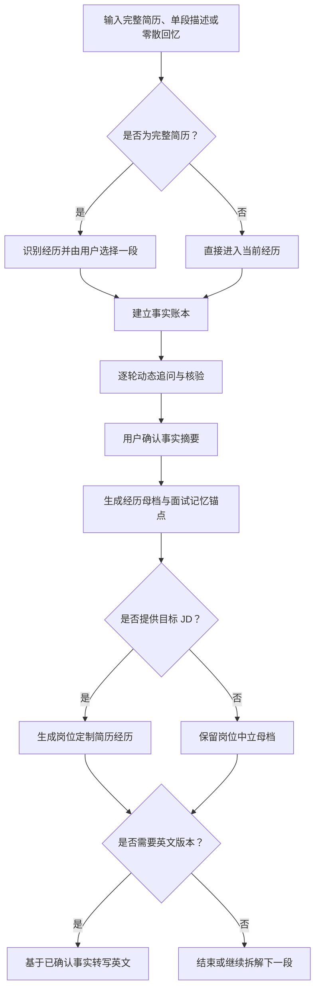

# 履历经历深挖（Resume Experience Deep Dive）

这是一个面向求职场景的 Codex Skill。它通过逐轮中文访谈，把一段零散、模糊或尚未成形的经历，整理成可核验、可复用的经历母档，并进一步生成面试记忆锚点、岗位定制简历经历和英文版本。

它不要求用户已经有完整简历：你可以上传整份中英文简历、粘贴一段经历，也可以只从记忆中的一个项目开始。

## 它能做什么

- 从完整简历中识别经历，并让用户选择其中一段深入拆解
- 接收单段文字、项目说明、零散笔记或口语化描述
- 对英文简历先做中文事实摘要，再继续中文访谈
- 动态追问项目背景、角色、行动、结果、困难、数据口径与个人贡献
- 在缺少量化结果时，寻找可验证的定性结果、过程证据和影响链路
- 从真实行动中归纳方法、检查清单、决策原则或 SOP，并明确这是事后归纳还是当时已有
- 生成经历母档与面试用 bullet points，而不是逐字背诵稿
- 可选读取目标岗位 JD，生成事实一致的岗位定制版本
- 经用户明确授权后，可联网研究公司、行业与公开方法论
- 基于已确认事实转写英文版本，无需重新访谈

## 工作方式



访谈不会机械地按照 STAR 顺序盘问。STAR 主要用于最后组织表达；提问顺序由当前事实缺口决定，每轮通常只问一个最关键的问题。

## 典型产出

### 1. 经历母档

- 标题
- 持续时间
- 角色与职责边界
- 约 100 字业务简介
- 项目背景、目标与团队分工
- 关键行动与决策
- 结果、证据和数据口径
- 困难、复盘与可改进之处
- 方法论沉淀及其可信边界
- 未知项、矛盾项和不应进入简历的内容

### 2. 面试记忆锚点

以 bullet points 形式保留项目背景、关键动作、数据口径、难点、复盘、行业洞察和个人沉淀，帮助用户在面试中自然组织语言。

### 3. 岗位定制简历经历

在用户提供 JD 后，将岗位要求与母档证据逐项映射，生成项目型、罗列型或混合型经历表述；缺失能力会明确提示，不会反向编造经历。

## 安装

将仓库克隆到 Codex Skills 目录：

### Windows PowerShell

```powershell
git clone https://github.com/Y664-series/resume-experience-deep-dive.git "$env:USERPROFILE\.codex\skills\resume-experience-deep-dive"
```

### macOS / Linux

```bash
git clone https://github.com/Y664-series/resume-experience-deep-dive.git ~/.codex/skills/resume-experience-deep-dive
```

重新打开 Codex 会话后即可使用。

## 如何触发

可以显式调用：

```text
用 $resume-experience-deep-dive 帮我拆解这段产品实习经历。
```

也可以直接描述需求，例如：

- “我有一份完整简历，帮我选一段经历深挖。”
- “我只记得做过一个增长项目，还没写进简历，帮我从头梳理。”
- “这是我的英文简历，先翻成中文事实摘要，再用中文访谈。”
- “这段经历没有明确的量化结果，还能怎么写？”
- “根据这份 JD，把已经确认的经历改成可投递版本。”
- “不要给我背诵稿，只整理面试时要记住的 bullet points。”

## 真实性原则

这个 Skill 的核心不是包装，而是建立可信边界：

- 不编造事实、指标、职责、决策权或公司信息
- 不把团队成果直接归因给个人
- 不为套用 STAR 强造数字
- 不把公开方法论冒充为用户当时使用过的方法
- 不在事实确认前生成最终可投递版本
- 不经用户明确同意联网研究公司、行业或公开方法

量化结果不是必需条件。若没有可靠数字，Skill 会优先确认可验证的定性变化，例如流程是否跑通、风险是否下降、决策是否获得依据、交付是否被采纳，以及用户的行动如何影响结果。

## 文件结构

```text
resume-experience-deep-dive/
├── SKILL.md
├── agents/
│   └── openai.yaml
└── references/
    ├── interview-framework.md
    ├── output-schemas.md
    ├── jd-tailoring-and-research.md
    └── evaluation-rubric.md
```

- `SKILL.md`：核心流程、边界与使用规则
- `interview-framework.md`：动态访谈与追问框架
- `output-schemas.md`：事实确认、母档、面试锚点与定制稿结构
- `jd-tailoring-and-research.md`：JD 映射、联网研究与外部方法论规则
- `evaluation-rubric.md`：Skill 的质量评估标准

## 适合谁

- 还没有正式简历，只知道自己“做过一些事”的求职者
- 有简历，但经历描述停留在职责罗列的人
- 希望核验数据、厘清个人贡献和准备面试追问的人
- 需要针对不同 JD 派生多个版本，又不想让事实漂移的人

