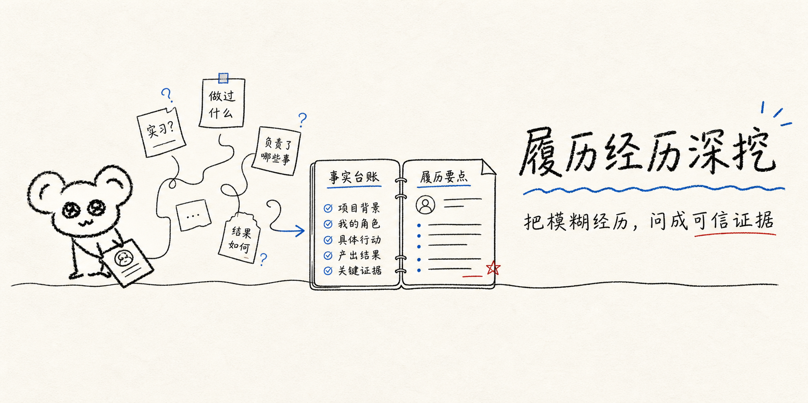

<div align="center">
  
</div>

# 履历经历深挖

**把模糊经历，问成可信证据。**

一个面向中文求职者的 Codex Skill：通过耐心、动态的单题追问，把完整简历、单段描述或零散回忆，整理成可核验的经历母档、面试记忆锚点，以及事实一致的岗位定制简历经历。

它不负责“把普通经历吹得厉害”，而是帮你找到真正做过什么、为什么这样做、如何影响结果，以及哪些内容经得住面试官继续追问。

---

## 三类入口

| 你手里的材料 | Skill 会怎么开始 |
| --- | --- |
| 一份完整的中文或英文简历 | 识别可独立拆解的经历，让你选择其中一段 |
| 一段简历文字、项目说明或零散笔记 | 直接建立这段经历的事实账本 |
| 只有模糊回忆，还没写过简历 | 从项目背景、角色和关键动作开始逐步还原 |

英文简历会先转成中文事实摘要供你核对，后续继续进行中文访谈；需要英文版本时，再基于已确认事实转写，不重新访谈。

## 三类核心产出

| 产出 | 用途 | 包含什么 |
| --- | --- | --- |
| **经历母档** | 长期留档、复用与持续补充 | 背景、角色、业务简介、行动、结果、证据、复盘、方法与未知项 |
| **面试记忆锚点** | 面试前快速复习 | 只保留 bullet points，不生成逐字背诵稿 |
| **岗位定制经历** | 针对特定 JD 投递 | JD 要求与母档证据映射、定制表述、能力缺口提示 |

同一份母档可以派生多个岗位版本；事实、数字、职责边界和因果关系不会随文案变化。

## 它怎么把经历问清楚

```text
“我参与了一个增长项目”
        ↓ 追问背景、目标和团队分工
“我负责了什么？”
        ↓ 追问具体动作、判断与取舍
“这件事为什么有效？”
        ↓ 核验结果、数据口径与个人贡献
事实账本
        ↓ 用户确认
经历母档 + 面试锚点 + 可选 JD 定制稿
```

访谈不会机械地按照 S、T、A、R 顺序盘问。STAR 用于最后组织表达；下一道问题由当前最重要的事实缺口决定，每轮通常只问一个核心问题。

## 一段经历的最终结构

- **标题**：这是一段什么样的经历
- **持续时间**：开始与结束时间
- **角色**：你承担的职责与决策边界
- **业务简介**：约 100 字说明业务、产品或项目是什么
- **具体事项**：结构化呈现关键任务、行动、结果与证据
- **困难与复盘**：问题、取舍、异常数据和再次执行时的改进
- **个人沉淀**：方法、检查清单、决策原则或 SOP

## 没有量化结果，也能拆

数字不是 STAR 的入场券，也不是结果的唯一形式。

当经历没有可靠指标时，Skill 会继续确认可验证的变化：

- 流程是否从不可用变为可运行
- 决策是否第一次获得了证据支持
- 风险、返工或沟通成本是否下降
- 交付是否被采用、上线、复用或进入下一阶段
- 用户的动作通过什么链路影响了团队结果

无法核验的数字不会被“补齐”；估算会保留计算依据和可信边界。

## 三条第一原则

1. **先确认事实，再生成文案。** 最终材料只来自用户确认后的事实账本。
2. **一次只问一个关键问题。** 这是一次耐心访谈，不是一张压迫感很强的问卷。
3. **不编造，不抢功，不强行量化。** 团队成果不会直接归因给个人，公开方法也不会冒充为用户当时已经使用的方法。

## 方法论可以由 Agent 帮你归纳

如果你做过一套连续动作，却没有主动把它总结成方法，Agent 可以事后归纳为步骤、检查清单、决策原则或简单 SOP。

归纳结果会明确区分：

- 这是你当时已经形成的方法，还是 Agent 事后总结
- 哪些真实行为支持这套归纳
- 适用场景和局限是什么
- 是否真正复用过并产生结果

经你明确授权后，Agent 还可以联网研究同岗位、同业务或同行业的公开方法，用于对照和补充追问；外部方法不会被写成你的亲身经历。

## 安装

### Windows PowerShell

```powershell
git clone https://github.com/Y664-series/resume-experience-deep-dive.git "$env:USERPROFILE\.codex\skills\resume-experience-deep-dive"
```

### macOS / Linux

```bash
git clone https://github.com/Y664-series/resume-experience-deep-dive.git ~/.codex/skills/resume-experience-deep-dive
```

重新打开 Codex 会话后即可使用。

## 用法

显式调用：

```text
用 $resume-experience-deep-dive 帮我拆解这段产品实习经历。
```

也可以直接说：

- “我有一份完整简历，帮我选一段经历深挖。”
- “我只记得做过一个增长项目，还没写进简历，帮我从头梳理。”
- “这是我的英文简历，先翻成中文事实摘要，再用中文访谈。”
- “这段经历没有明确的量化结果，还能怎么写？”
- “根据这份 JD，把确认后的经历改成可投递版本。”
- “不要背诵稿，只整理面试时要记住的 bullet points。”

## 文件结构

```text
resume-experience-deep-dive/
├── SKILL.md
├── agents/
│   └── openai.yaml
└── references/
    ├── interview-framework.md
    ├── output-schemas.md
    ├── jd-tailoring-and-research.md
    └── evaluation-rubric.md
```

- `SKILL.md`：核心流程、使用规则与真实性边界
- `interview-framework.md`：动态访谈与追问框架
- `output-schemas.md`：事实确认、母档、面试锚点与定制稿结构
- `jd-tailoring-and-research.md`：JD 映射、联网研究与公开方法论规则
- `evaluation-rubric.md`：Skill 质量评估标准

## 适合谁

- 还没有正式简历，只知道自己“做过一些事”的求职者
- 有简历，但经历描述仍停留在职责罗列的人
- 希望核验数据、厘清个人贡献和准备面试追问的人
- 需要针对不同 JD 派生多个版本，又不想让事实漂移的人

